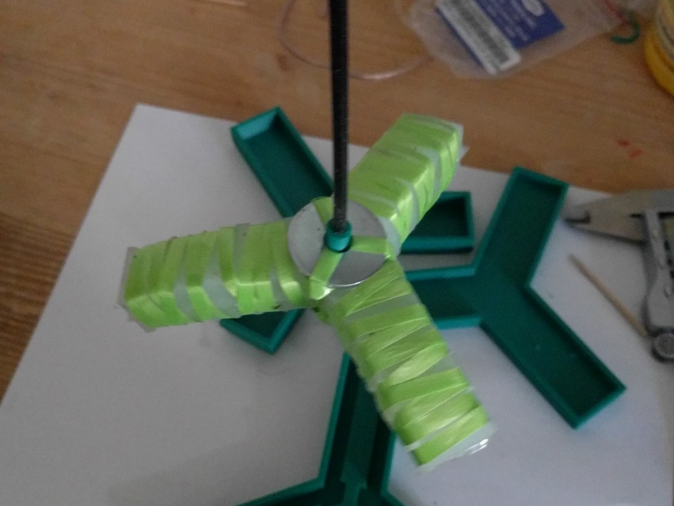

# Gripper

Gripper project FreeCAD & STL files for gripper molds.

# Example Images

 Instead of paper in the inner part, I used cotton
ribbons (sewing supply). I should have ironed them before, they did not want to stay flat:-(

 I used two big washers above and below the middle part. But
the lower washer was too large, so the gripper did not fit into the mold for the last coat of silicone:-(

 The ribbons do not stay in place very well

